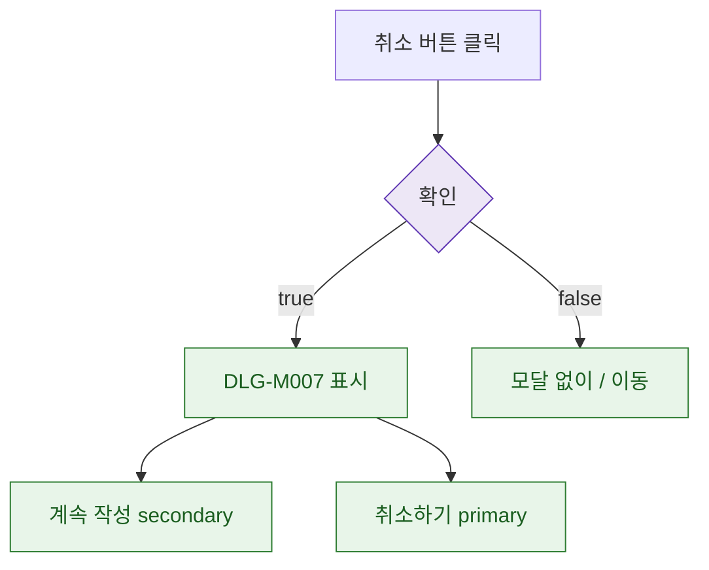

## 1. 목적

DLG-M007은 입력 필드 없는 ConfirmDialog이므로 조건만 명세한다.

## 2. 트리거/전제조건

- 취소 버튼 클릭 시점

## 3. 다이어그램

## 4. 엣지 설명

| 출발 | 도착 | 조건 |
|------|------|------|
| 확인 | 모달 표시 | true |
| 확인 | / 이동 | false |
