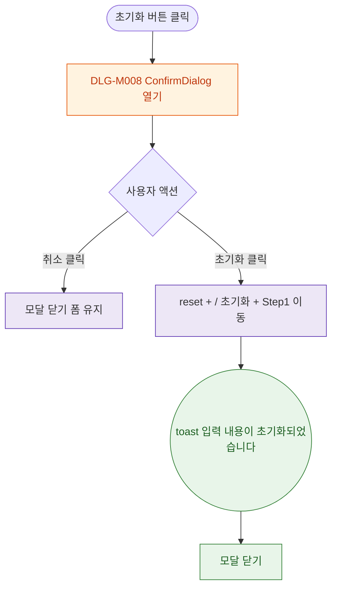

## 1. 목적

DLG-M008 폼 초기화 확인 다이얼로그의 열기/닫기/완료 생명주기를 명세한다.

## 2. 트리거/전제조건

- 회원 등록/수정 > "초기화" 버튼 클릭

## 3. 다이어그램

## 4. 엣지 설명

| 출발 | 도착 | 조건 |
|------|------|------|
| 초기화 버튼 | 모달 열기 | - |
| 취소 | 모달 닫기 | - |
| 초기화 | reset 실행 | 클릭 |
| reset | toast | - |
| toast | 모달 닫기 | - |
