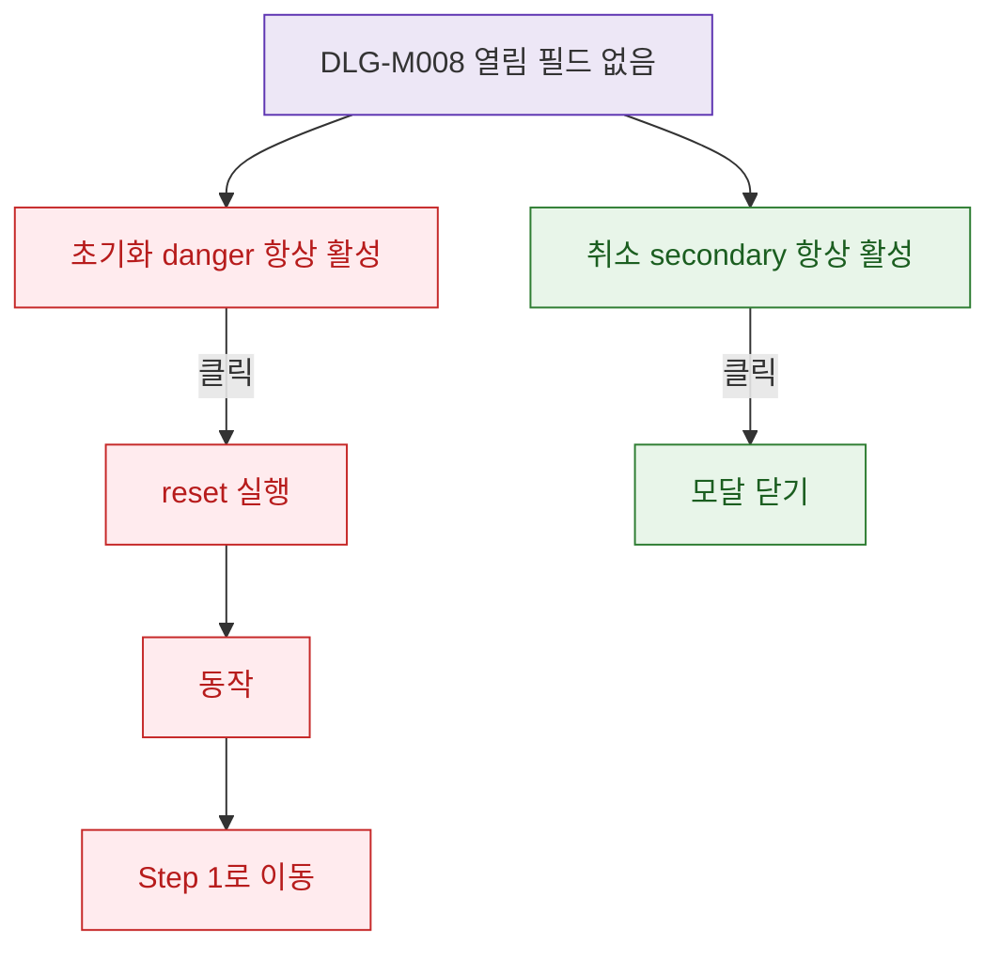

## 1. 목적

DLG-M008은 입력 필드 없는 ConfirmDialog이며 초기화 후 상태 변경 사항을 명세한다.

## 2. 트리거/전제조건

- DLG-M008 열린 상태

## 3. 다이어그램

## 4. 엣지 설명

| 출발 | 도착 | 조건 |
|------|------|------|
| 초기화 버튼 | reset 실행 | 클릭 |
| 취소 | 모달 닫기 | 클릭 |
