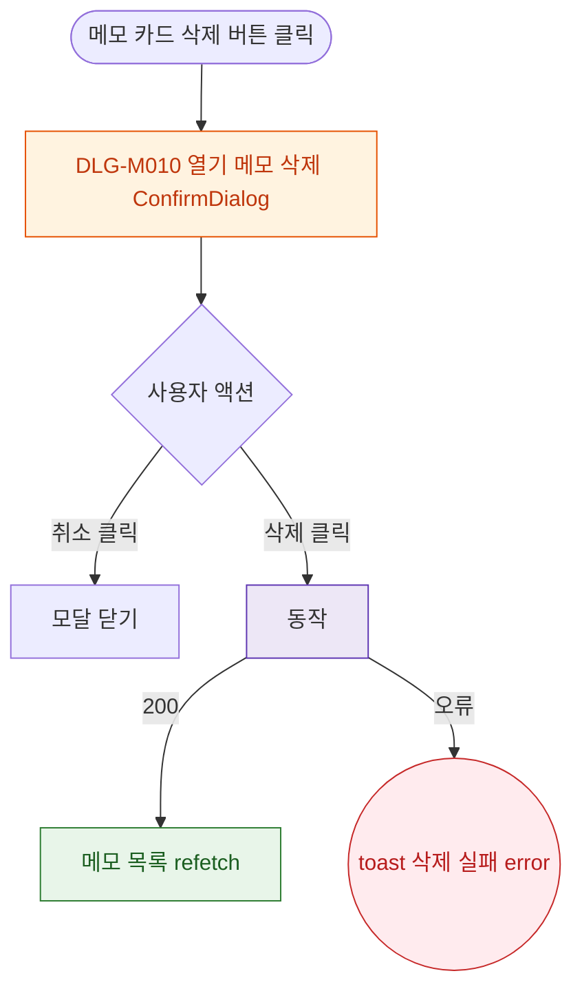

## 1. 목적

DLG-M010 메모 삭제 확인 다이얼로그의 열기/닫기/완료 생명주기를 명세한다.

## 2. 트리거/전제조건

- 상담메모 탭 > 메모 카드 > "삭제" 버튼 클릭

## 3. 다이어그램

## 4. 엣지 설명

| 출발 | 도착 | 조건 |
|------|------|------|
| 삭제 버튼 | 모달 열기 | - |
| 취소 | 모달 닫기 | - |
| 삭제 | API | 확인 클릭 |
| API | 목록 갱신 | 200 |
| API | toast | 오류 |
