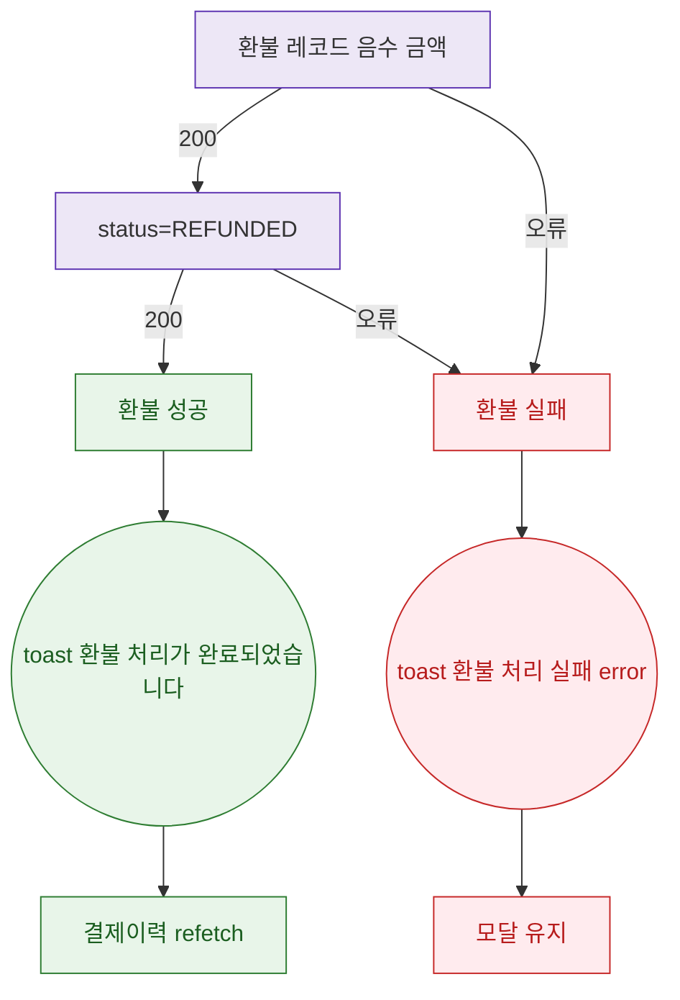

## 1. 목적

DLG-M013 환불 API 응답별 결과 분기를 명세한다.

## 2. 트리거/전제조건

- (환불 레코드) + PUT 원본 status=REFUNDED 호출 후

## 3. 다이어그램

## 4. 엣지 설명

| 출발 | 도착 | 조건 |
|------|------|------|
| 환불 | 원본 | 200 |
| 원본 | 성공 | 200 |
| 환불 | 실패 | 오류 |
| 성공 | toast | - |
| 실패 | toast | - |
