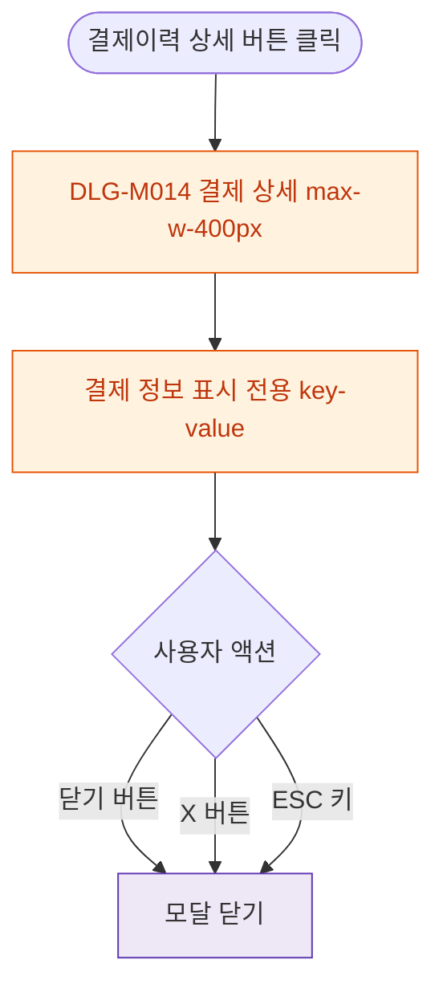

## 1. 목적

DLG-M014 결제 상세 조회 다이얼로그의 열기/닫기 생명주기를 명세한다.

## 2. 트리거/전제조건

- 결제이력/결제내역 탭 > "상세" 버튼 클릭

## 3. 다이어그램

## 4. 엣지 설명

| 출발 | 도착 | 조건 |
|------|------|------|
| 상세 버튼 | 모달 열기 | - |
| 닫기 버튼 | 모달 닫기 | - |
| X 버튼 | 모달 닫기 | p-xs rounded-full |
| ESC 키 | 모달 닫기 | - |
