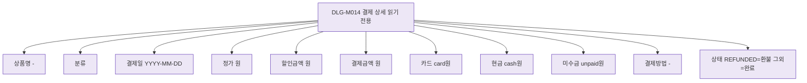

## 1. 목적

DLG-M014는 읽기 전용 표시 모달이므로 표시 필드 매핑을 명세한다.

## 2. 트리거/전제조건

- DLG-M014 열린 상태

## 3. 다이어그램

```mermaid
flowchart TD
  DLG[DLG-M014 결제 상세 읽기 전용]

  DLG --> F1[상품명 -]
  DLG --> F2[분류]
  DLG --> F3[결제일 YYYY-MM-DD]
  DLG --> F4[정가 원]
  DLG --> F5[할인금액 원]
  DLG --> F6[결제금액 원]
  DLG --> F7[카드 card원]
  DLG --> F8[현금 cash원]
  DLG --> F9[미수금 unpaid원]
  DLG --> F10[결제방법 -]
  DLG --> F11[상태 REFUNDED=환불 그외=완료]

  classDef system fill:#EDE7F6,stroke:#5E35B2

  class DLG,F1,F2,F3,F4,F5,F6,F7,F8,F9,F10,F11 system
```

## 4. 엣지 설명

표시 전용 — 엣지 없음.
