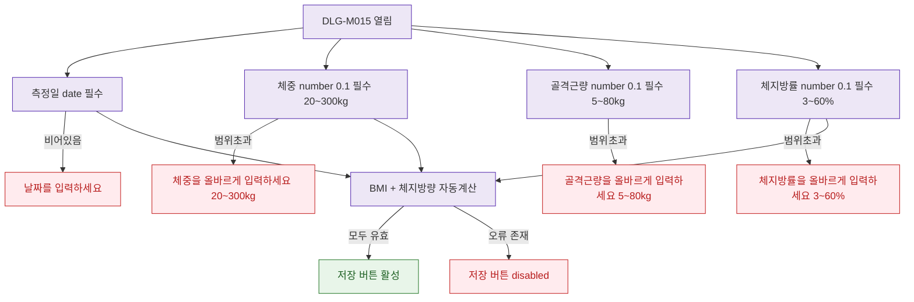

## 1. 목적

DLG-M015의 필드별 유효성 검증 흐름을 명세한다.

## 2. 트리거/전제조건

- DLG-M015 열린 상태

## 3. 다이어그램

## 4. 엣지 설명

| 출발 | 도착 | 조건 |
|------|------|------|
| 측정일 | 에러 | 비어있음 |
| 체중 | 에러 | 20~300 범위 초과 |
| 골격근량 | 에러 | 5~80 범위 초과 |
| 체지방률 | 에러 | 3~60 범위 초과 |
| 자동계산 | 버튼 활성 | 모두 유효 |
