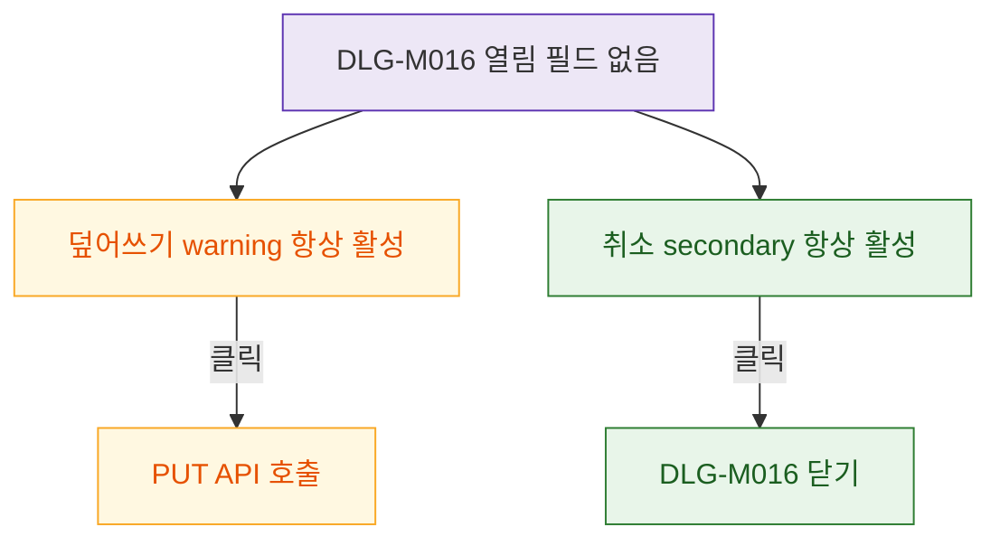

## 1. 목적

DLG-M016은 입력 필드 없는 ConfirmDialog이므로 버튼 상태만 명세한다.

## 2. 트리거/전제조건

- DLG-M016 열린 상태

## 3. 다이어그램

## 4. 엣지 설명

| 출발 | 도착 | 조건 |
|------|------|------|
| 덮어쓰기 버튼 | API | 클릭 |
| 취소 버튼 | 모달 닫기 | 클릭 |
