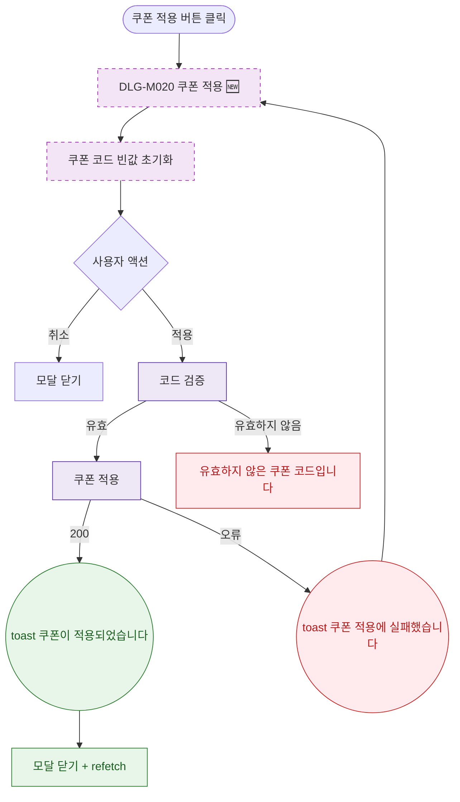

## 1. 목적

DLG-M020 쿠폰 적용 다이얼로그의 열기/닫기/완료 생명주기를 명세한다. 🆕 미구현 기능.

## 2. 트리거/전제조건

- 상세내역 탭 > 쿠폰 서브탭 > "쿠폰 적용" 버튼 클릭

## 3. 다이어그램

## 4. 엣지 설명

| 출발 | 도착 | 조건 |
|------|------|------|
| 적용 | 코드 검증 API | 클릭 |
| 검증 | 쿠폰 적용 API | 유효 |
| 검증 | 에러 메시지 | 유효하지 않음 |
| 적용 API | toast | 200 |
