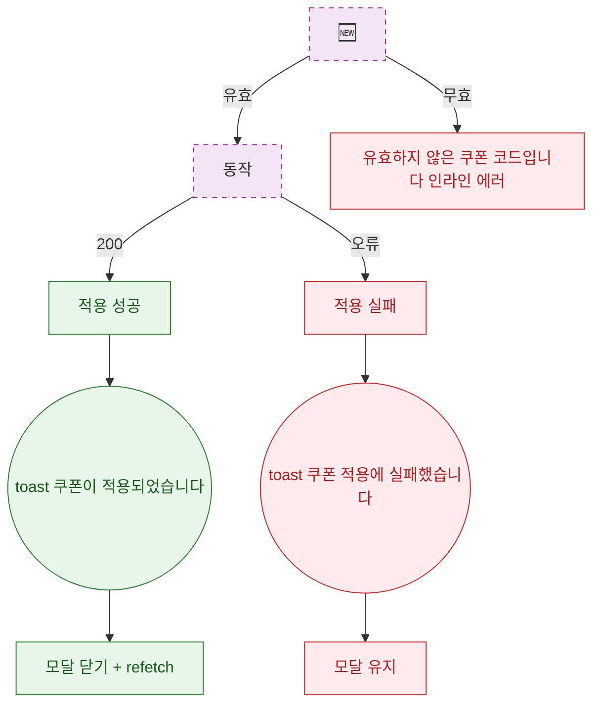

## 1. 목적

DLG-M020 쿠폰 코드 검증 및 적용 API 응답별 결과 분기를 명세한다. 🆕 미구현 기능.

## 2. 트리거/전제조건

- + 호출 후

## 3. 다이어그램

## 4. 엣지 설명

| 출발 | 도착 | 조건 |
|------|------|------|
| 검증 API | 적용 API | 유효 코드 |
| 검증 API | 인라인 에러 | 무효 코드 |
| 적용 API | 성공 | 200 |
| 적용 API | 실패 | 오류 |
