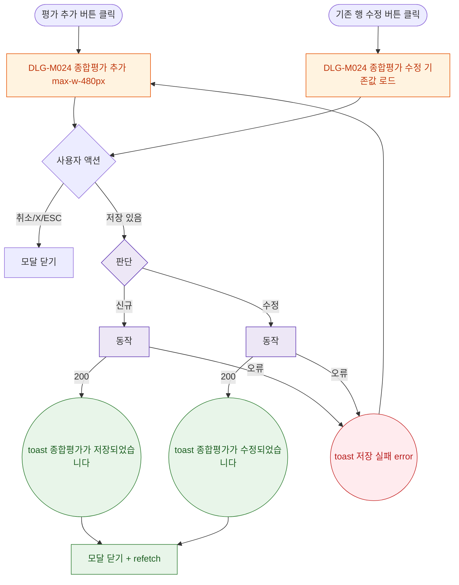

## 1. 목적

DLG-M024 종합평가 추가/수정 다이얼로그의 열기/닫기/완료 생명주기를 명세한다.

## 2. 트리거/전제조건

- 종합평가 탭 > "평가 추가" 버튼 클릭 (신규)
- 또는 기존 행 "수정" 버튼 클릭 (수정)

## 3. 다이어그램

## 4. 엣지 설명

| 출발 | 도착 | 조건 |
|------|------|------|
| 평가 추가 | 모달(신규) | - |
| 수정 버튼 | 모달(수정) | 기존값 로드 |
| 저장 | API 분기 | 있음 |
| | toast 저장됨 | 200 |
| | toast 수정됨 | 200 |
