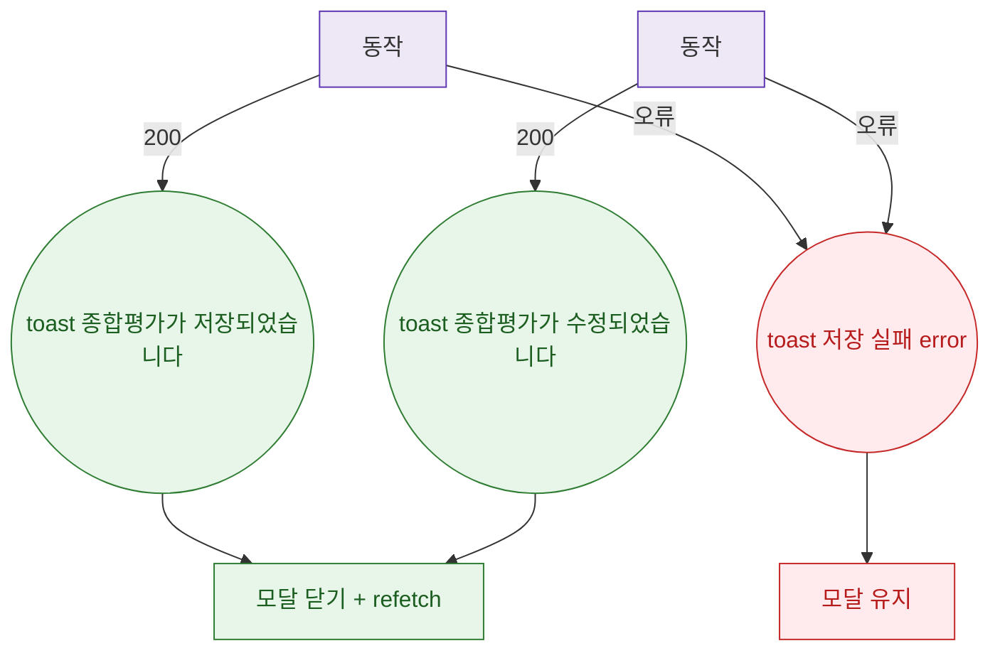

## 1. 목적

DLG-M024 종합평가 저장 API 응답별 결과 분기를 명세한다.

## 2. 트리거/전제조건

- POST 또는 호출 후

## 3. 다이어그램

## 4. 엣지 설명

| 출발 | 도착 | 조건 |
|------|------|------|
| API | toast 저장됨 | 200 |
| API | toast 수정됨 | 200 |
| API | toast | 오류 |
| toast | 닫기+갱신 | - |
