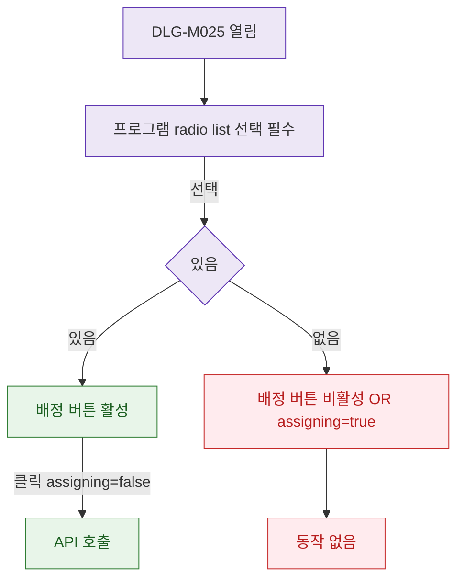

## 1. 목적

DLG-M025의 프로그램 선택 유효성 검증을 명세한다.

## 2. 트리거/전제조건

- DLG-M025 열린 상태

## 3. 다이어그램

## 4. 엣지 설명

| 출발 | 도착 | 조건 |
|------|------|------|
| 선택 확인 | 버튼 활성 | 있음 |
| 선택 확인 | 버튼 비활성 | 미선택 OR assigning |
| 버튼 활성 | API | assigning=false |
