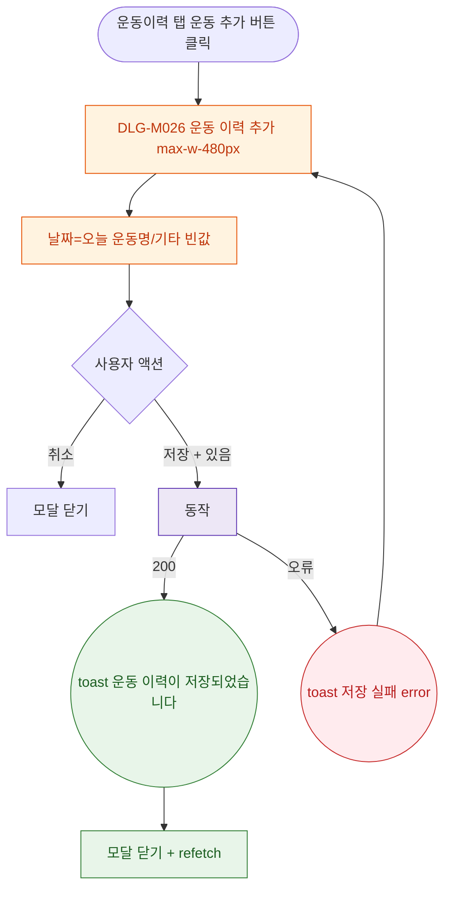

## 1. 목적

DLG-M026 운동 이력 추가 다이얼로그의 열기/닫기/완료 생명주기를 명세한다.

## 2. 트리거/전제조건

- 운동이력 탭 > "운동 추가" 버튼 클릭

## 3. 다이어그램

## 4. 엣지 설명

| 출발 | 도착 | 조건 |
|------|------|------|
| 운동 추가 | 모달 열기 | - |
| 저장 | API | + 있음 |
| API | toast | 200 |
| API | toast | 오류 |
