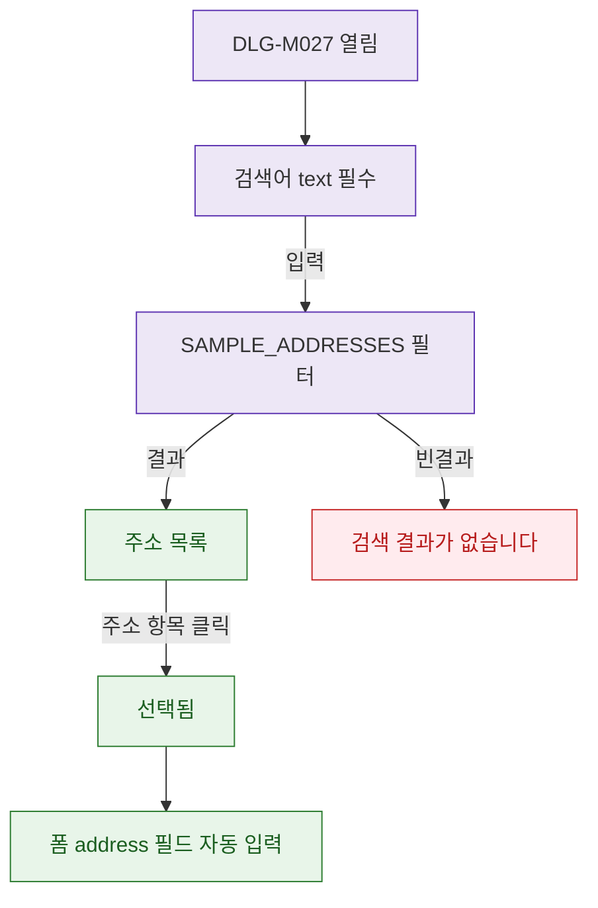

## 1. 목적

DLG-M027의 검색어 입력과 결과 선택 검증을 명세한다.

## 2. 트리거/전제조건

- DLG-M027 열린 상태

## 3. 다이어그램

## 4. 엣지 설명

| 출발 | 도착 | 조건 |
|------|------|------|
| 검색어 | 검색 실행 | 입력 |
| 검색 | 결과 목록 | 결과 있음 |
| 검색 | 빈 결과 | 결과 없음 |
| 결과 클릭 | 선택됨 | - |
| 선택됨 | 폼 자동 입력 | - |
