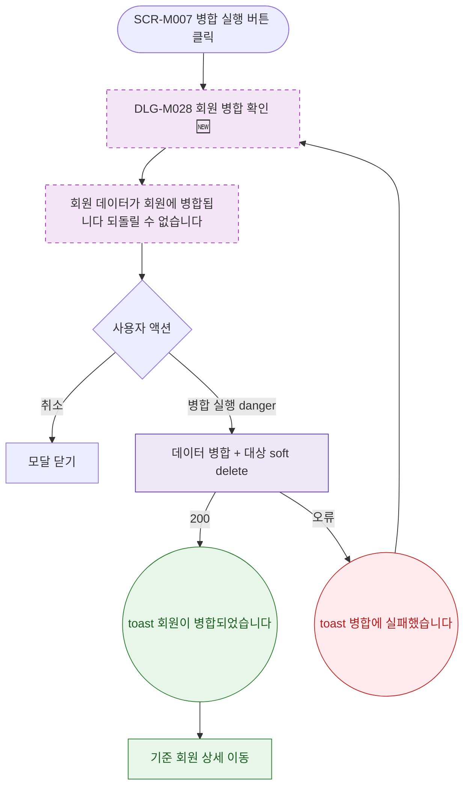

## 1. 목적

DLG-M028 회원 병합 확인 다이얼로그의 열기/닫기/완료 생명주기를 명세한다. 🆕 미구현 기능.

## 2. 트리거/전제조건

- 회원 병합(SCR-M007) > "병합 실행" 버튼 클릭

## 3. 다이어그램

## 4. 엣지 설명

| 출발 | 도착 | 조건 |
|------|------|------|
| 병합 실행 | 모달 열기 | - |
| 취소 | 모달 닫기 | - |
| 병합 실행 | API | danger 버튼 클릭 |
| API | toast | 200 |
| toast | 기준 회원 상세 이동 | - |
| API | toast | 오류 |
