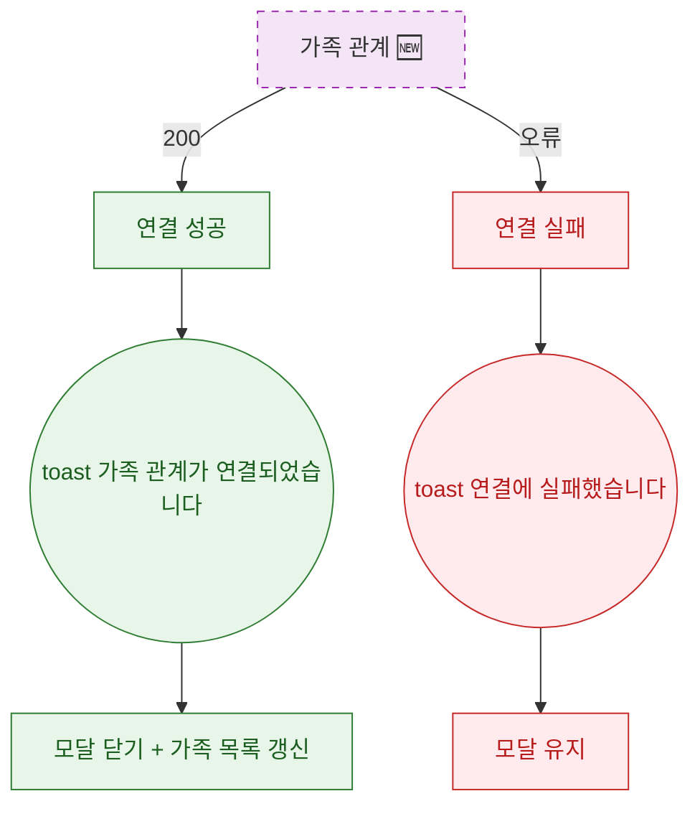

## 1. 목적

DLG-M029 가족 관계 연결 API 응답별 결과 분기를 명세한다. 🆕 미구현 기능.

## 2. 트리거/전제조건

- 호출 후

## 3. 다이어그램

## 4. 엣지 설명

| 출발 | 도착 | 조건 |
|------|------|------|
| API | 성공 | 200 |
| API | 실패 | 오류 |
| 성공 | toast | - |
| toast | 모달 닫기 + 목록 갱신 | - |
| 실패 | toast | - |
| toast | 모달 유지 | - |
