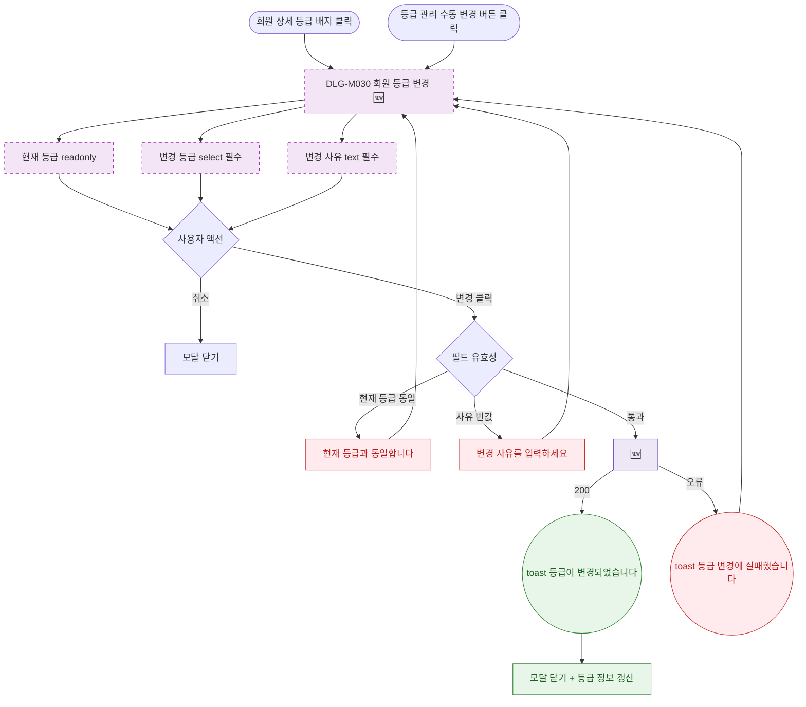

## 1. 목적

DLG-M030 회원 등급 변경 다이얼로그의 열기/닫기/완료 생명주기를 명세한다. 🆕 미구현 기능.

## 2. 트리거/전제조건

- 회원 상세 > 등급 배지 클릭 (관리자) 또는 등급 관리 > "수동 변경" 버튼 클릭

## 3. 다이어그램

## 4. 엣지 설명

| 출발 | 도착 | 조건 |
|------|------|------|
| 등급 배지 클릭 | 모달 열기 | 회원 상세 |
| 수동 변경 버튼 | 모달 열기 | 등급 관리 |
| 취소 | 모달 닫기 | - |
| 변경 버튼 | 유효성 검사 | 클릭 |
| 유효성 실패 | 에러 표시 | 현재 등급 동일 |
| 유효성 실패 | 에러 표시 | 사유 빈값 |
| 유효성 통과 | API 호출 | - |
| API | toast | 200 |
| toast | 모달 닫기 + 갱신 | - |
| API | toast | 오류 |
