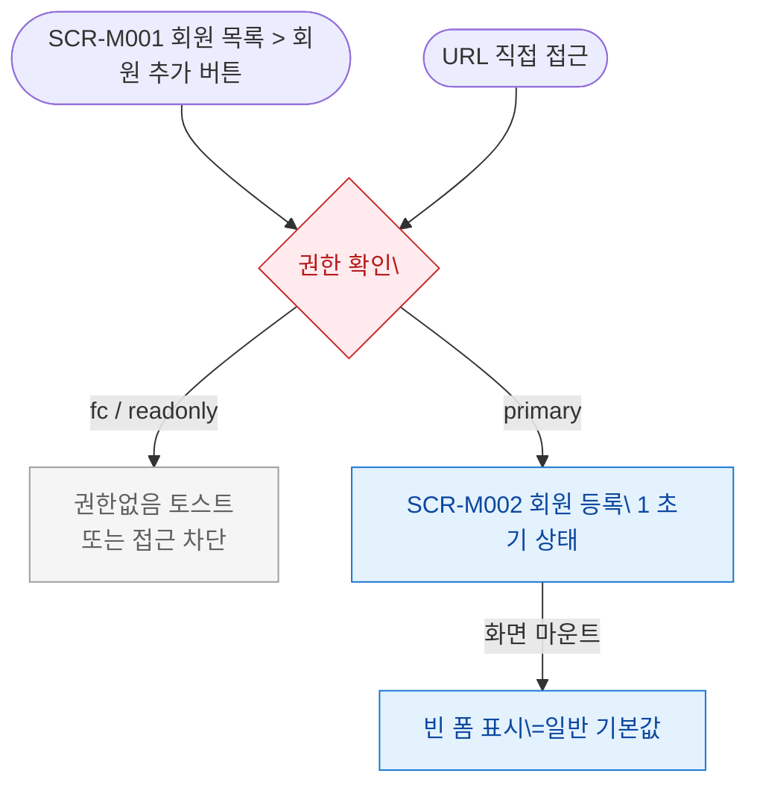

## 1. 목적

SCR-M002 회원 등록 화면에 진입할 수 있는 모든 경로를 명세한다. 진입 TC 원천.

## 2. 전제조건

- 사용자가 로그인 상태이다.
- 세션이 유효하다.

## 3. 다이어그램

## 4. 엣지 설명 테이블

| 출발 | 도착 | 조건 |
|------|------|------|
| 회원 목록 버튼 | 권한 확인 | 회원 추가 버튼 클릭 |
| URL 직접 | 권한 확인 | 접근 |
| 권한 확인 | 차단 | fc/readonly |
| 권한 확인 | SCR-M002 | primary |
| SCR-M002 | 폼 초기화 | 마운트 시 Step 1 빈 폼 |
