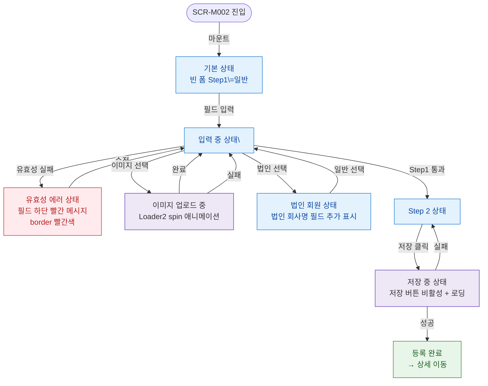

## 1. 목적

SCR-M002의 UI 상태(기본/유효성에러/이미지업로드중/저장중/법인선택) 분기를 명세한다.

## 2. 전제조건

- SCR-M002가 진입된 상태이다.

## 3. 다이어그램

## 4. 엣지 설명 테이블

| 출발 | 도착 | 조건 |
|------|------|------|
| 진입 | 기본 상태 | 마운트 시 Step1 빈 폼 |
| 기본 | 입력 중 | 필드 입력 시작, |
| 입력 중 | 에러 상태 | 유효성 검증 실패 |
| 에러 | 입력 중 | 필드 수정 |
| 입력 중 | 이미지 로딩 | 파일 선택 후 업로드 시작 |
| 이미지 로딩 | 입력 중 | 업로드 완료 |
| 이미지 로딩 | 입력 중 | 업로드 실패 |
| 입력 중 | 법인 상태 | =기명/무기명 선택 |
| 법인 상태 | 입력 중 | =일반 선택 |
| 입력 중 | Step 2 | Step1 검증 통과 |
| Step 2 | 저장 중 | 저장 버튼 클릭, |
| 저장 중 | 완료 | API 성공 |
| 저장 중 | Step 2 | API 실패, 폼 유지 |
