## 1. 목적

SCR-M002에서 발생하는 모든 토스트 메시지(성공/경고/에러/정보)의 발생 조건을 명세한다.

## 2. 전제조건

- SCR-M002 회원 등록 폼이 표시된 상태이다.

## 3. 다이어그램

```mermaid
flowchart TD
  SCR_M002[SCR-M002 회원 등록]

  subgraph SUCCESS_TOASTS [success 토스트]
    T_REG_OK((신규 회원이 등록되었습니다.\n+ 바로 결제 액션 5초))
    T_IMG_OK((프로필 이미지가 등록되었습니다.))
    T_RESET_OK((입력 내용이 초기화되었습니다.))
    T_PHONE_OK[인라인 초록 — 사용 가능한 번호입니다.]
  end

  subgraph ERROR_TOASTS [error 토스트]
    T_SAVE_API_ERR((저장에 실패했습니다.\nres))
    T_SAVE_EX_ERR((저장 중 오류가 발생했습니다.\nerr))
    T_PHONE_DUP[인라인 빨강 — 이미 등록된 번호입니다.]
    T_PHONE_DUP_TOAST((이미 등록된 번호입니다.))
    T_DUP_INCOMPLETE((전화번호 중복 확인을 해주세요.))
    T_DUP_ERR((중복확인 중 오류가 발생했습니다.))
    T_IMG_TYPE((이미지 파일만 업로드 가능합니다.))
    T_IMG_SIZE((파일 크기는 5MB 이하여야 합니다.))
    T_IMG_ERR((이미지 업로드 실패 — result))
  end

  SCR_M002 -->|등록 성공|T_REG_OK
  SCR_M002 -->|API 오류 응답|T_SAVE_API_ERR
  SCR_M002 -->|예외 발생|T_SAVE_EX_ERR
  SCR_M002 -->|중복확인 통과|T_PHONE_OK
  SCR_M002 -->|중복번호 인라인|T_PHONE_DUP
  SCR_M002 -->|중복번호 토스트|T_PHONE_DUP_TOAST
  SCR_M002 -->|다음 클릭 미확인|T_DUP_INCOMPLETE
  SCR_M002 -->|중복확인 API 실패|T_DUP_ERR
  SCR_M002 -->|이미지 업로드 성공|T_IMG_OK
  SCR_M002 -->|이미지 타입 오류|T_IMG_TYPE
  SCR_M002 -->|크기 초과|T_IMG_SIZE
  SCR_M002 -->|업로드 실패|T_IMG_ERR
  SCR_M002 -->|초기화 완료|T_RESET_OK

  T_REG_OK -->|바로 결제 클릭 5초 내|PAYMENT_PAGE[결제 페이지\n🆕]

  classDef screen fill:#E3F2FD,stroke:#1976D2,color:#0D47A1
  classDef modal fill:#FFF3E0,stroke:#F57C00,color:#E65100
  classDef newFeature fill:#F3E5F5,stroke:#9C27B0,stroke-dasharray:5 5
  classDef error fill:#FFEBEE,stroke:#C62828,color:#B71C1C
  classDef success fill:#E8F5E9,stroke:#2E7D32,color:#1B5E20
  classDef warning fill:#FFF8E1,stroke:#F9A825,color:#F57F17
  classDef info fill:#E0F7FA,stroke:#00838F
  classDef system fill:#EDE7F6,stroke:#5E35B2
  classDef external fill:#ECEFF1,stroke:#455A64,stroke-dasharray:3 3
  classDef cron fill:#E0F2F1,stroke:#00695C
  classDef rbacBlocked fill:#F5F5F5,stroke:#9E9E9E,color:#616161

  class SCR_M002 screen
  class PAYMENT_PAGE newFeature
  class T_REG_OK,T_IMG_OK,T_RESET_OK,T_PHONE_OK success
  class T_SAVE_API_ERR,T_SAVE_EX_ERR,T_PHONE_DUP,T_PHONE_DUP_TOAST,T_DUP_INCOMPLETE,T_DUP_ERR,T_IMG_TYPE,T_IMG_SIZE,T_IMG_ERR error
```

## 4. 엣지 설명 테이블

| 출발 | 도착 | 타입 | 메시지 |
|------|------|------|--------|
| SCR-M002 | 등록 완료 | success | "신규 회원이 등록되었습니다." + 바로 결제 액션 5초 |
| SCR-M002 | API 에러 | error | res ?? "저장에 실패했습니다." |
| SCR-M002 | 예외 에러 | error | err ?? "저장 중 오류가 발생했습니다." |
| SCR-M002 | 사용 가능 | success(인라인) | "사용 가능한 번호입니다." |
| SCR-M002 | 중복 인라인 | error(인라인) | "이미 등록된 번호입니다." |
| SCR-M002 | 미확인 토스트 | error | "전화번호 중복 확인을 해주세요." |
| SCR-M002 | 중복확인 오류 | error | "중복확인 중 오류가 발생했습니다." |
| SCR-M002 | 이미지 완료 | success | "프로필 이미지가 등록되었습니다." |
| SCR-M002 | 타입 에러 | error | "이미지 파일만 업로드 가능합니다." |
| SCR-M002 | 크기 에러 | error | "파일 크기는 5MB 이하여야 합니다." |
| SCR-M002 | 업로드 실패 | error | "이미지 업로드 실패: ${result}" |
| SCR-M002 | 초기화 완료 | success | "입력 내용이 초기화되었습니다." |
