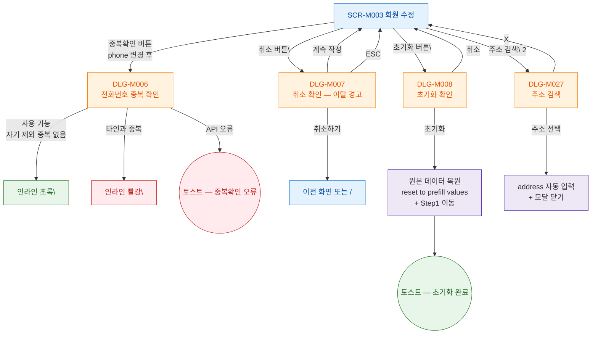

## 1. 목적

SCR-M003에서 트리거되는 모든 모달/다이얼로그의 진입 경로 트리를 명세한다.

## 2. 전제조건

- SCR-M003 회원 수정 화면이 표시된 상태이다.

## 3. 다이어그램

## 4. 엣지 설명 테이블

| 출발 | 도착 | 조건 |
|------|------|------|
| SCR-M003 | DLG-M006 | 연락처 변경 후 중복확인 클릭 |
| SCR-M003 | DLG-M007 | 취소, (이탈 경고) |
| SCR-M003 | DLG-M008 | 초기화 버튼 |
| SCR-M003 | DLG-M027 | 주소 검색, Step 2 |
| DLG-M006 | 사용 가능 | 결과 없음 |
| DLG-M006 | 중복 | 타인 번호 중복 |
| DLG-M007 | 이전 화면 | 취소하기 |
| DLG-M007 | SCR-M003 | 계속 작성 |
| DLG-M008 | 원본 복원 | 기존 데이터로 reset (등록과 차이) |
| DLG-M027 | 주소 자동 입력 | 주소 선택 |
