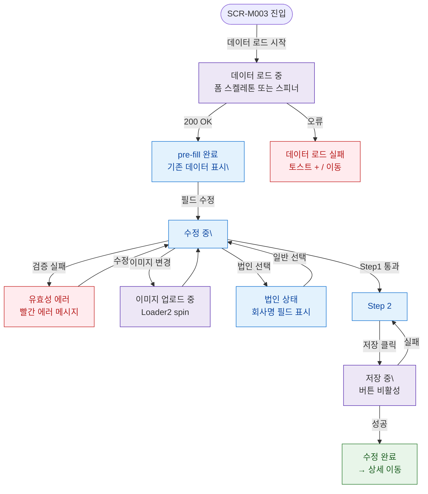

## 1. 목적

SCR-M003의 UI 상태(데이터 로드중/pre-fill완료/수정중/저장중/에러) 분기를 명세한다.

## 2. 전제조건

- SCR-M003 진입이 시도된 상태이다.

## 3. 다이어그램

## 4. 엣지 설명 테이블

| 출발 | 도착 | 조건 |
|------|------|------|
| 진입 | 스켈레톤 | 시작 |
| 스켈레톤 | pre-fill | 200 OK |
| 스켈레톤 | 로드 실패 | 오류, / 이동 |
| pre-fill | 수정 중 | 필드 변경, |
| 수정 중 | 에러 | 검증 실패 |
| 수정 중 | 이미지 로딩 | 파일 선택 |
| 수정 중 | 법인 상태 | 변경 |
| 수정 중 | Step2 | Step1 통과 |
| Step2 | 저장 중 | 저장 클릭 |
| 저장 중 | 완료 | API 성공 |
| 저장 중 | Step2 | API 실패 |
