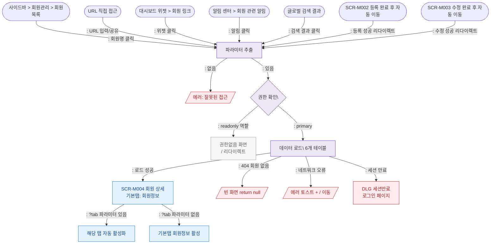

## 1. 목적

SCR-M004 회원 상세 화면에 진입 가능한 모든 경로를 정의한다. 진입 시 파라미터 유효성 검증 및 권한 확인 분기를 포함한다.

## 2. 전제조건

- 로그인 세션 유효
- 파라미터 존재

## 3. 다이어그램

## 4. 엣지 설명

| 출발 | 도착 | 조건/액션 |
|------|------|-----------|
| SCR-M001 회원목록 | ROUTE | 회원명(ghost 버튼) 클릭 |
| URL 직접 | ROUTE | |
| 대시보드 | ROUTE | 위젯 내 회원 링크 클릭 |
| 알림 센터 | ROUTE | 회원 관련 알림 딥링크 |
| 글로벌 검색 | ROUTE | 검색 결과 회원 항목 클릭 |
| SCR-M002 | ROUTE | 등록 완료 후 자동 리다이렉트 |
| SCR-M003 | ROUTE | 수정 완료 후 자동 리다이렉트 |
| ROUTE | ERR_NOID | 쿼리 파라미터 누락 |
| ROUTE | AUTH | 정상 추출 |
| AUTH | BLOCKED | readonly 역할 — 진입 차단 |
| AUTH | LOAD | 그 외 역할 — 데이터 로드 |
| LOAD | M004 | Promise 성공 |
| LOAD | ERR_NOTFOUND | member 쿼리 결과 null |
| LOAD | ERR_NET | 네트워크/API 오류 |
| LOAD | SESSION | 401 세션 만료 |
| M004 | TAB | ?tab 파라미터 존재 |
| M004 | TAB_DEFAULT | ?tab 파라미터 없음 |
