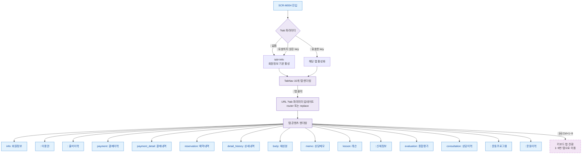

## 1. 목적

SCR-M004의 15개 탭 전환 플로우와 URL ?tab 파라미터 동기화를 정의한다.

## 2. 전제조건

- SCR-M004 진입 완료

## 3. 다이어그램

## 4. 엣지 설명

| 조건/액션 |
|-----------|
| ?tab 파라미터 없음 → 기본탭 info |
| 유효한 tab key → 해당 탭 활성 |
| 유효하지 않은 key → 기본탭 fallback |
| 탭 클릭 → URL 업데이트 + 콘텐츠 전환 |
| 🆕 Ctrl+1~9 키 → 해당 번호 탭 전환 |
