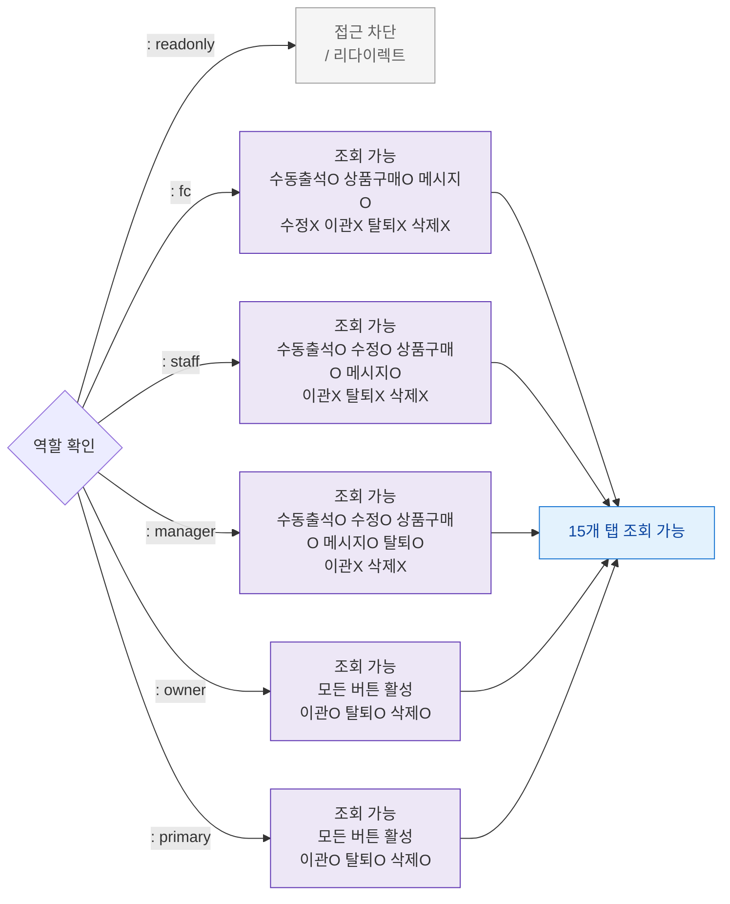

## 1. 목적

SCR-M004에서 6개 역할별 접근/액션 가능 범위를 정의한다.

## 2. 전제조건

- 로그인 세션 유효

## 3. 다이어그램

## 4. 엣지 설명

| 역할 | 접근 범위 |
|------|-----------|
| readonly | 접근 완전 차단 |
| fc | 조회+수동출석+상품구매+메시지만 가능 |
| staff | 조회+수정+수동출석+상품구매+메시지 가능 |
| manager | 조회+수정+수동출석+상품구매+메시지+탈퇴 가능 |
| owner | 전체 버튼 가능 |
| primary | 전체 버튼 가능 |
