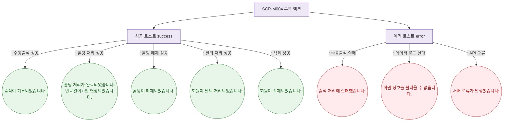

## 1. 목적

SCR-M004 루트(프로필 헤더/하단 상태관리)에서 발생하는 모든 토스트 메시지의 발생 조건을 정의한다.

## 2. 전제조건

- SCR-M004 데이터 로드 완료

## 3. 다이어그램

## 4. 엣지 설명

| 상황 | 타입 | 메시지 |
|------|------|--------|
| 수동출석 성공 | success | "출석이 기록되었습니다." |
| 홀딩 처리 성공 | success | "홀딩 처리가 완료되었습니다. 만료일이 {n}일 연장되었습니다." |
| 홀딩 해제 성공 | success | "홀딩이 해제되었습니다." |
| 탈퇴 처리 성공 | success | "회원이 탈퇴 처리되었습니다." |
| 삭제 성공 | success | "회원이 삭제되었습니다." |
| 수동출석 실패 | error | "출석 처리에 실패했습니다." |
| 데이터 로드 실패 | error | "회원 정보를 불러올 수 없습니다." |
| API 오류 | error | "서버 오류가 발생했습니다." |
