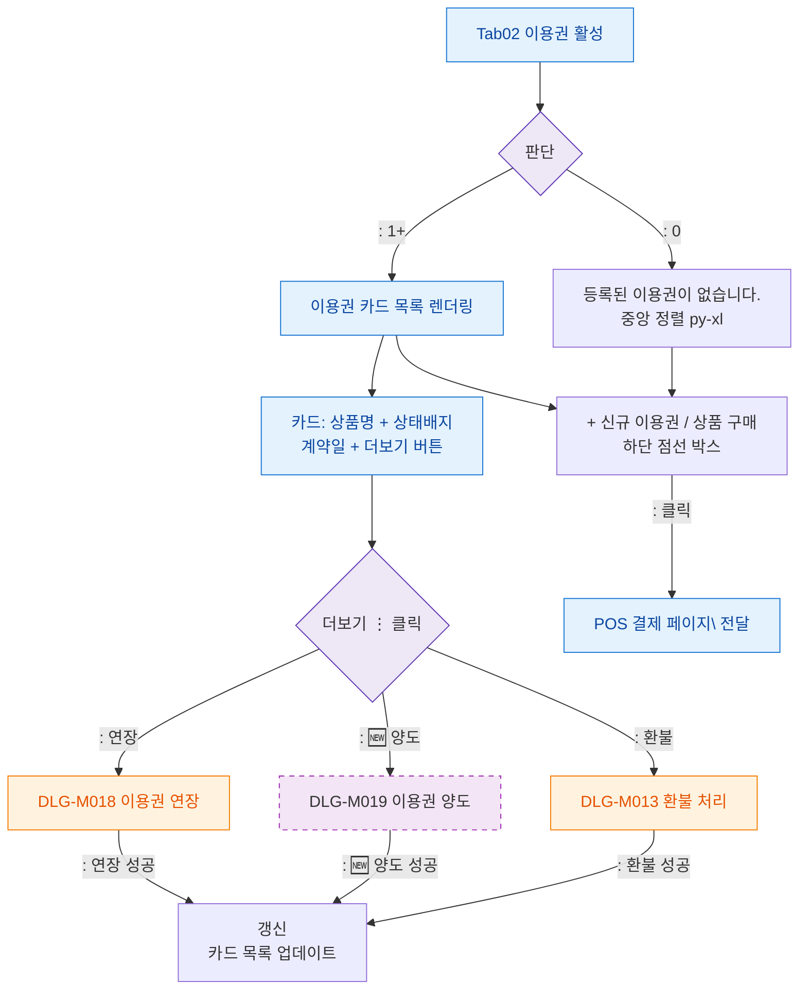

## 1. 목적

이용권 탭(SCR-M004-02)의 계약 카드 목록 표시 및 신규 구매 플로우를 정의한다.

## 2. 전제조건

- SCR-M004 진입 완료, tab= 활성
- 데이터 로드 완료

## 3. 다이어그램

## 4. 엣지 설명

| 조건/액션 | 결과 |
|-----------|------|
| =0 | 빈 상태 메시지 |
| | 카드 목록 렌더링 |
| 더보기 > 연장 | DLG-M018 열기 |
| 더보기 > 🆕 양도 | DLG-M019 열기 |
| 더보기 > 환불 | DLG-M013 열기 |
| 신규 이용권 버튼 클릭 | POS 페이지 이동 |
| 연장 성공 | 카드 목록 갱신 |
| 🆕 양도 성공 | 카드 목록 갱신 |
| 환불 성공 | 카드 목록 갱신 |
