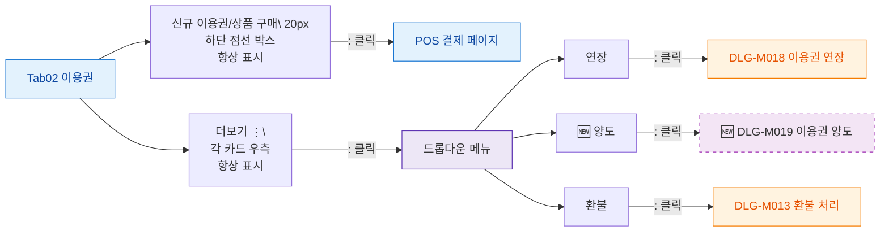

## 1. 목적

이용권 탭의 모든 버튼 노드와 동작을 정의한다.

## 2. 전제조건

- Tab02 이용권 활성

## 3. 다이어그램

## 4. 엣지 설명

| 버튼 | 동작 |
|------|------|
| 신규 이용권/상품 구매 | POS 페이지 이동 |
| 더보기 ⋮ | 드롭다운 표시 |
| 연장 | DLG-M018 열기 |
| 🆕 양도 | DLG-M019 열기 |
| 환불 | DLG-M013 열기 |
