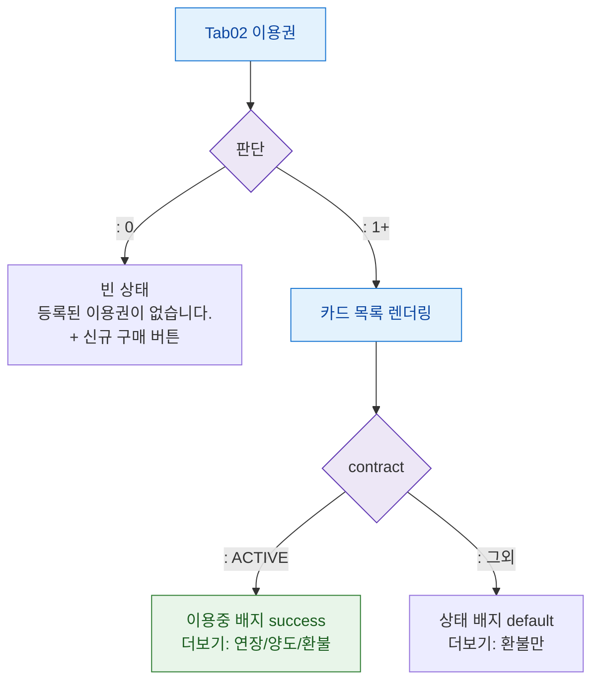

## 1. 목적

이용권 탭의 계약 상태(없음/이용중/만료)별 화면 분기를 정의한다.

## 2. 전제조건

- Tab02 이용권 활성

## 3. 다이어그램

## 4. 엣지 설명

| 조건 | 화면 |
|------|------|
| 없음 | 빈 상태 메시지 + 구매 버튼 |
| 있음 | 카드 목록 |
| ACTIVE 계약 | 이용중 배지, 연장/양도/환불 메뉴 |
| 비활성 계약 | 상태 배지, 환불만 표시 |
