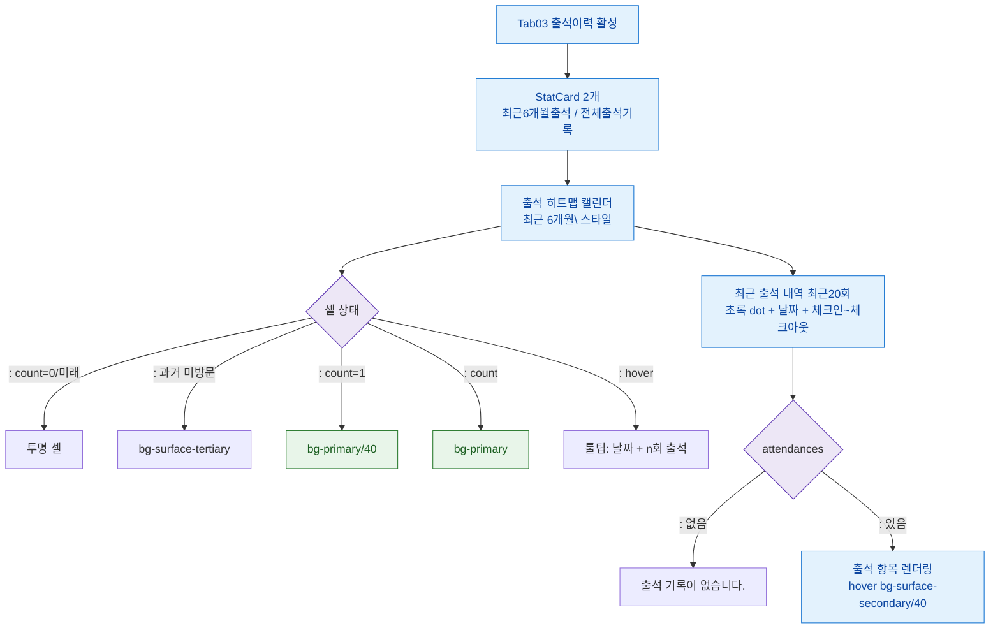

## 1. 목적

출석이력 탭(SCR-M004-03)의 히트맵 캘린더와 출석 리스트 표시 플로우를 정의한다.

## 2. 전제조건

- tab= 활성, attendances 데이터 로드 완료

## 3. 다이어그램

## 4. 엣지 설명

| 조건 | 결과 |
|------|------|
| count=0 또는 미래 날짜 | 투명 셀 |
| 과거 날짜, 방문 없음 | 회색 셀 |
| count=1 | 연한 primary 셀 |
| count | 진한 primary 셀 |
| 셀 hover | 날짜+횟수 툴팁 |
| 출석 없음 | 빈 상태 메시지 |
| 출석 있음 | 리스트 렌더링 |
