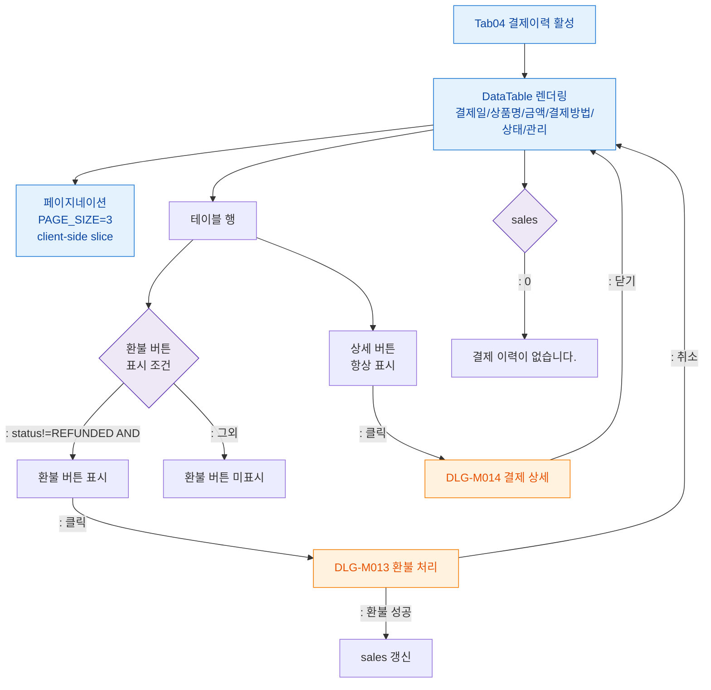

## 1. 목적

결제이력 탭(SCR-M004-04)의 결제 테이블 표시 및 상세/환불 버튼 플로우를 정의한다.

## 2. 전제조건

- tab=payment 활성, sales 데이터 로드 완료

## 3. 다이어그램

## 4. 엣지 설명

| 조건 | 결과 |
|------|------|
| status!=REFUNDED AND | 환불 버튼 표시 |
| REFUNDED 또는 | 환불 버튼 미표시 |
| 상세 버튼 클릭 | DLG-M014 열기 |
| 환불 버튼 클릭 | DLG-M013 열기 |
| 상세 모달 닫기 | 테이블 유지 |
| 환불 성공 | sales 갱신 |
| 환불 취소 | 테이블 유지 |
| 결제 없음 | 빈 상태 메시지 |
