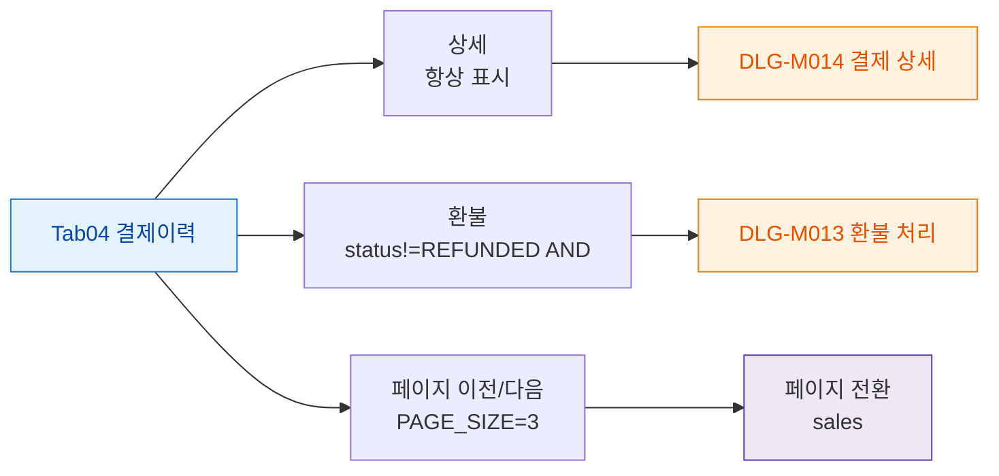

## 1. 목적

결제이력 탭의 버튼 전체를 정의한다.

## 2. 전제조건

- Tab04 결제이력 활성

## 3. 다이어그램

```mermaid
flowchart LR
  TAB[Tab04 결제이력] --> B1[상세\n항상 표시]
  TAB --> B2[환불\nstatus!=REFUNDED AND]
  TAB --> B3[페이지 이전/다음\nPAGE_SIZE=3]

  B1 --> DLG_M014[DLG-M014 결제 상세]
  B2 --> DLG_M013[DLG-M013 환불 처리]
  B3 --> PAGE[페이지 전환\nsales]

  classDef screen fill:#E3F2FD,stroke:#1976D2,color:#0D47A1
  classDef modal fill:#FFF3E0,stroke:#F57C00,color:#E65100
  classDef system fill:#EDE7F6,stroke:#5E35B2
  class TAB screen
  class DLG_M014,DLG_M013 modal
  class PAGE system
```

## 4. 엣지 설명

| 버튼 | 동작 |
|------|------|
| 상세 | DLG-M014 열기 |
| 환불 | DLG-M013 열기 |
| 페이지 이동 | client-side 슬라이스 |
