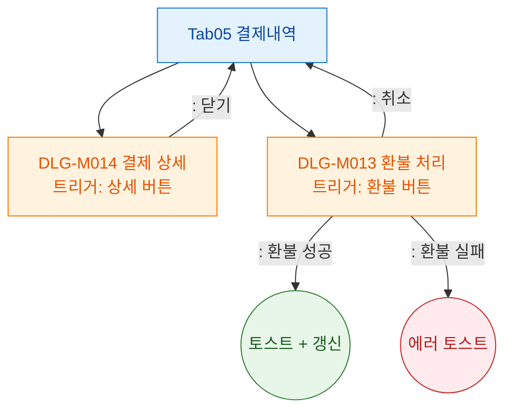

## 1. 목적

결제내역 탭 모달 트리거를 정의한다. Tab04와 동일 모달 사용.

## 2. 전제조건

- Tab05 결제내역 활성

## 3. 다이어그램

```mermaid
flowchart TD
  TAB[Tab05 결제내역] --> DLG_M014[DLG-M014 결제 상세\n트리거: 상세 버튼]
  TAB --> DLG_M013[DLG-M013 환불 처리\n트리거: 환불 버튼]

  DLG_M014 -->|": 닫기"|TAB
  DLG_M013 -->|": 환불 성공"|OK((토스트 + 갱신))
  DLG_M013 -->|": 환불 실패"|ERR((에러 토스트))
  DLG_M013 -->|": 취소"|TAB

  classDef screen fill:#E3F2FD,stroke:#1976D2,color:#0D47A1
  classDef modal fill:#FFF3E0,stroke:#F57C00,color:#E65100
  classDef success fill:#E8F5E9,stroke:#2E7D32,color:#1B5E20
  classDef error fill:#FFEBEE,stroke:#C62828,color:#B71C1C
  class TAB screen
  class DLG_M014,DLG_M013 modal
  class OK success
  class ERR error
```

## 4. 엣지 설명

Tab04_결제이력/F5_모달트리거 와 동일 패턴. DLG-M014/M013 동일 사용.
