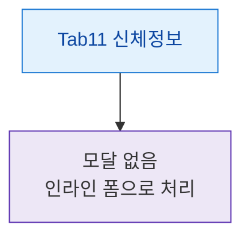

## 1. 목적

신체정보 탭은 별도 다이얼로그 없이 인라인 폼으로 처리하므로 트리거되는 모달이 없다.

## 2. 전제조건

- Tab11 신체정보 활성

## 3. 다이어그램

```mermaid
flowchart TD
  TAB[Tab11 신체정보] --> NOTE[모달 없음\n인라인 폼으로 처리]

  classDef screen fill:#E3F2FD,stroke:#1976D2,color:#0D47A1
  classDef system fill:#EDE7F6,stroke:#5E35B2
  class TAB screen
  class NOTE system
```

## 4. 엣지 설명

해당 없음 — 신체정보 탭은 인라인 폼을 사용하며 별도 모달을 트리거하지 않는다.
