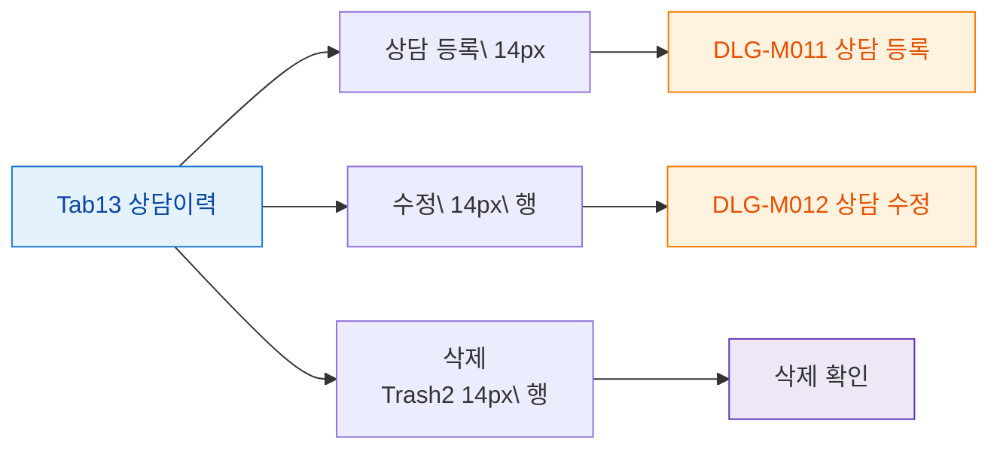

## 1. 목적

상담이력 탭의 버튼 전체를 정의한다.

## 2. 전제조건

- Tab13 상담이력 활성

## 3. 다이어그램

```mermaid
flowchart LR
  TAB[Tab13 상담이력] --> B1[상담 등록\ 14px]
  TAB --> B2[수정\ 14px\ 행]
  TAB --> B3[삭제\nTrash2 14px\ 행]

  B1 --> DLG_M011[DLG-M011 상담 등록]
  B2 --> DLG_M012[DLG-M012 상담 수정]
  B3 --> DEL_CONFIRM[삭제 확인]

  classDef screen fill:#E3F2FD,stroke:#1976D2,color:#0D47A1
  classDef modal fill:#FFF3E0,stroke:#F57C00,color:#E65100
  classDef system fill:#EDE7F6,stroke:#5E35B2
  class TAB screen
  class DLG_M011,DLG_M012 modal
  class DEL_CONFIRM system
```

## 4. 엣지 설명

| 버튼 | 동작 |
|------|------|
| 상담 등록 | DLG-M011 열기 |
| 수정 | DLG-M012 기존 데이터 프리필 |
| 삭제 | 삭제 확인 |
