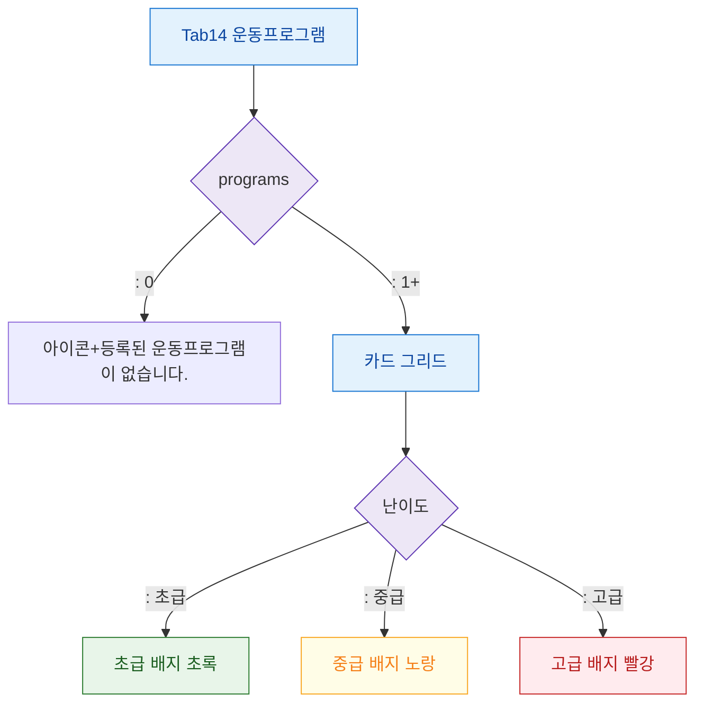

## 1. 목적

운동프로그램 탭의 데이터 유무 및 난이도 배지 분기를 정의한다.

## 2. 전제조건

- Tab14 운동프로그램 활성

## 3. 다이어그램

## 4. 엣지 설명

| 조건 | 화면 |
|------|------|
| 프로그램 없음 | 빈 상태 메시지 |
| 프로그램 있음 | 카드 그리드 |
| 난이도 초급 | 초록 배지 |
| 난이도 중급 | 노랑 배지 |
| 난이도 고급 | 빨강 배지 |
