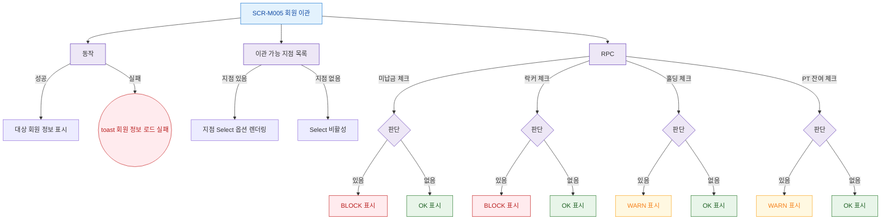

## 1. 목적

SCR-M005의 체크리스트 항목별 조회 로직 및 지점 목록 필터를 명세한다.

## 2. 트리거/전제조건

- SCR-M005 진입 완료, 파라미터 유효

## 3. 다이어그램

## 4. 엣지 설명

| 출발 | 도착 | 조건 |
|------|------|------|
| 회원 API | 회원 정보 표시 | 200 OK |
| 회원 API | toast | 실패 |
| 지점 API | 지점 Select | 지점 있음 |
| 지점 API | Select 비활성 | 지점 없음 |
| 미납금 확인 | BLOCK | |
| 락커 확인 | BLOCK | |
| 홀딩 확인 | WARN | |
| PT 확인 | WARN | |
