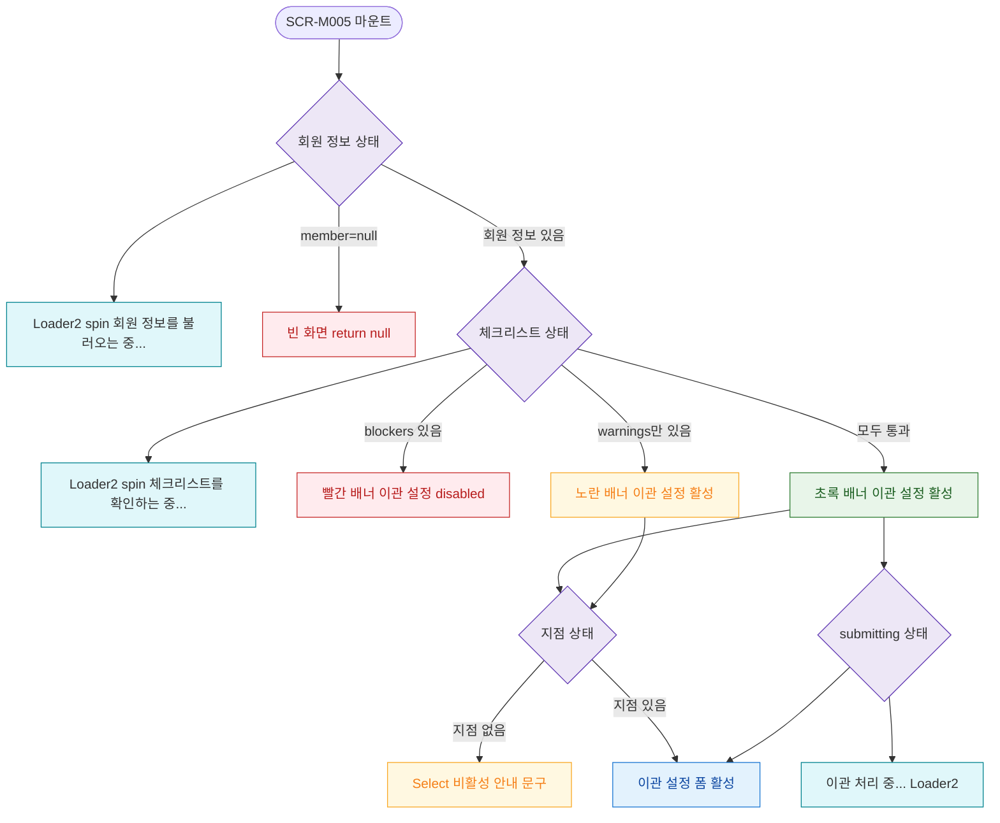

## 1. 목적

SCR-M005의 로딩/빈/에러/권한없음 등 UI 상태별 화면 분기를 명세한다.

## 2. 트리거/전제조건

- SCR-M005 마운트 시점

## 3. 다이어그램

## 4. 엣지 설명

| 출발 | 도착 | 조건 |
|------|------|------|
| 회원 정보 상태 | 로딩 스피너 | fetch 중 |
| 회원 정보 상태 | 빈 화면 | member=null |
| 회원 정보 상태 | 체크리스트 상태 | 회원 있음 |
| 체크리스트 상태 | 로딩 스피너 | fetch 중 |
| 체크리스트 상태 | 빨간 배너 | blockers |
| 체크리스트 상태 | 노란 배너 | warnings만 존재 |
| 체크리스트 상태 | 초록 배너 | 모두 통과 |
| 지점 상태 | 비활성 안내 | 지점 없음 |
| submitting 상태 | 처리 중 UI | submitting=true |
