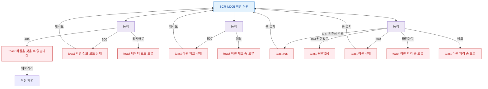

## 1. 목적

SCR-M005에서 발생 가능한 에러 코드별 분기와 복구 경로를 명세한다.

## 2. 트리거/전제조건

- SCR-M005에서 API 호출 실패 발생 시

## 3. 다이어그램

## 4. 엣지 설명

| 출발 | 도착 | 조건 |
|------|------|------|
| 회원 API | toast | 404 Not Found |
| 회원 API | toast | 500 Server Error |
| 회원 API | toast | 타임아웃 |
| 체크 API | toast | 500 |
| 이관 API | toast | 400 유효성 오류 |
| 이관 API | toast | 403 권한없음 |
| 이관 API | toast | 500 |
| 이관 API | toast | 타임아웃 |
