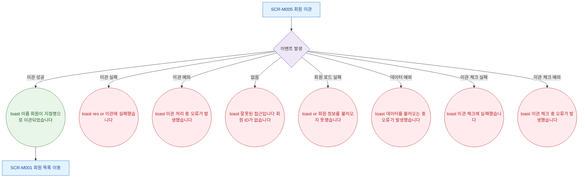

## 1. 목적

SCR-M005에서 발생하는 모든 토스트 메시지와 피드백 조건을 명세한다.

## 2. 트리거/전제조건

- SCR-M005 진입 후 각 액션 수행 시

## 3. 다이어그램

## 4. 엣지 설명

| 출발 | 도착 | 조건 |
|------|------|------|
| 이벤트 | toast | 이관 API 200 |
| 이벤트 | toast | 이관 실패 |
| 이벤트 | toast | catch 예외 |
| 이벤트 | toast | 없음 |
| 이벤트 | toast | 회원 로드 실패 |
| 이벤트 | toast | 체크 API 실패 |
| toast | 회원 목록 | 자동 이동 |
