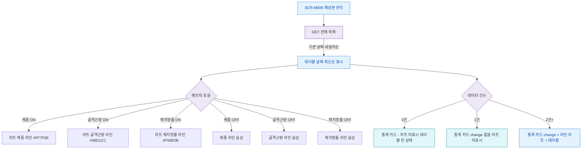

## 1. 목적

SCR-M006의 차트 메트릭 토글, 테이블 정렬, 데이터 조회 조건을 명세한다.

## 2. 트리거/전제조건

- SCR-M006 데이터 로드 완료

## 3. 다이어그램

## 4. 엣지 설명

| 출발 | 도착 | 조건 |
|------|------|------|
| 데이터 로드 | 테이블 정렬 | 기본 날짜 내림차순 |
| 메트릭 토글 | 체중 라인 표시 | 체중 ON |
| 메트릭 토글 | 골격근량 라인 표시 | 골격근량 ON |
| 메트릭 토글 | 체지방률 라인 표시 | 체지방률 ON |
| 데이터 건수 | 빈 상태 | 0건 |
| 데이터 건수 | 1건 UI | 1건 |
| 데이터 건수 | 전체 UI | 2건+ |
