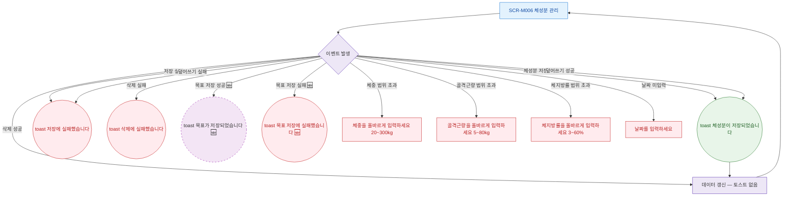

## 1. 목적

SCR-M006에서 발생하는 모든 토스트 메시지와 피드백 조건을 명세한다.

## 2. 트리거/전제조건

- SCR-M006에서 각 액션 수행 시

## 3. 다이어그램

## 4. 엣지 설명

| 출발 | 도착 | 조건 |
|------|------|------|
| 이벤트 | toast | 체성분 저장 성공 |
| 이벤트 | toast | 저장 실패 |
| 이벤트 | toast | 삭제 실패 |
| 이벤트 | 필드 에러 | 체중 범위 오류 |
| 이벤트 | 필드 에러 | 골격근량 범위 오류 |
| 이벤트 | 필드 에러 | 체지방률 범위 오류 |
| 이벤트 | 필드 에러 | 날짜 미입력 |
