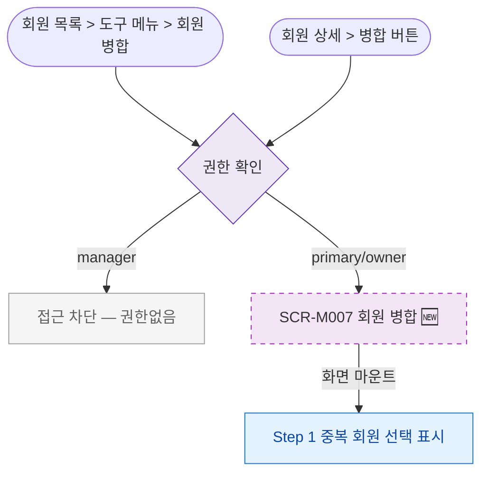

## 1. 목적

SCR-M007 회원 병합 화면에 진입할 수 있는 모든 경로를 명세한다. 🆕 미구현 기능.

## 2. 트리거/전제조건

- 사용자가 로그인 상태이다.
- primary 또는 owner 역할이다.

## 3. 다이어그램

## 4. 엣지 설명

| 출발 | 도착 | 조건 |
|------|------|------|
| 회원 목록 도구메뉴 | 권한 확인 | 메뉴 클릭 |
| 회원 상세 병합 버튼 | 권한 확인 | 클릭 |
| 권한 확인 | 접근 차단 | manager |
| 권한 확인 | SCR-M007 | primary/owner |
| SCR-M007 | Step 1 | 마운트 |
