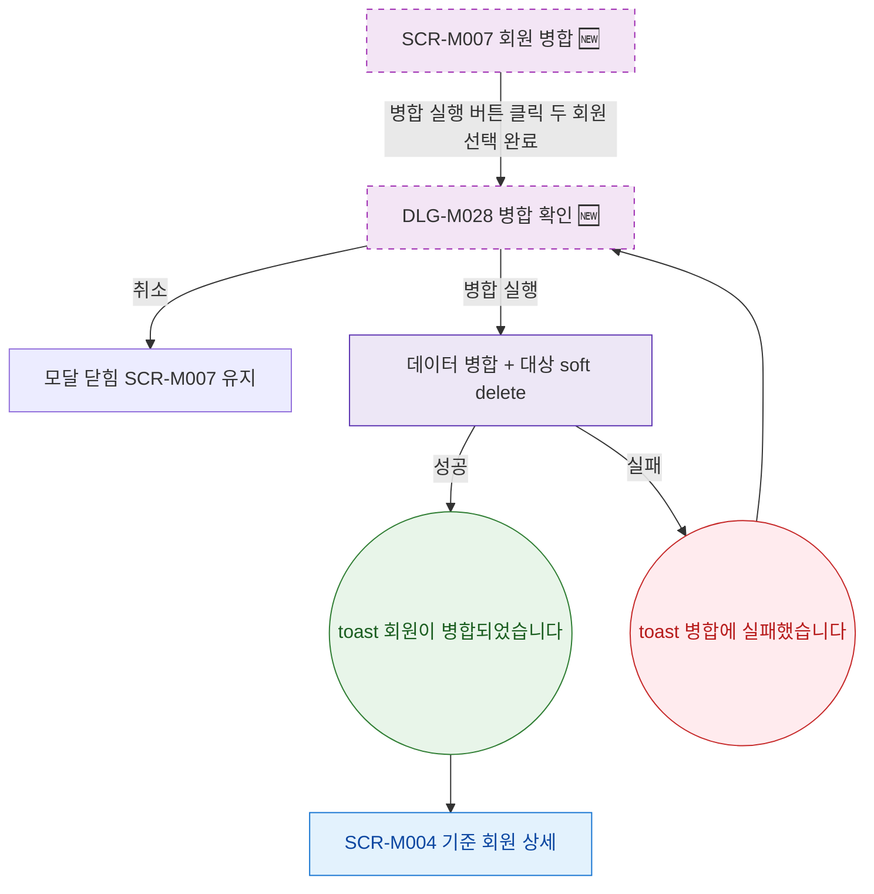

## 1. 목적

SCR-M007에서 열리는 모달의 트리거 경로를 명세한다. 🆕 미구현 기능.

## 2. 트리거/전제조건

- SCR-M007 Step 3 미리보기 완료

## 3. 다이어그램

## 4. 엣지 설명

| 출발 | 도착 | 조건 |
|------|------|------|
| 병합 실행 버튼 | DLG-M028 | 두 회원 선택 완료 |
| DLG-M028 | 모달 닫힘 | 취소 |
| DLG-M028 | 병합 API | 실행 |
| 병합 API | toast | 성공 |
| 병합 API | toast | 실패, 모달 유지 |
