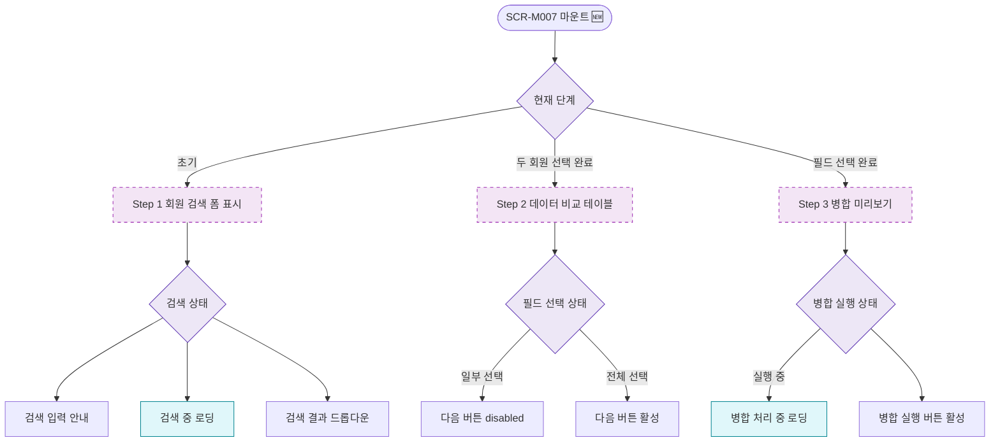

## 1. 목적

SCR-M007의 단계별 UI 상태 분기를 명세한다. 🆕 미구현 기능.

## 2. 트리거/전제조건

- SCR-M007 마운트

## 3. 다이어그램

## 4. 엣지 설명

| 출발 | 도착 | 조건 |
|------|------|------|
| 단계 상태 | Step 1 UI | 초기 |
| 단계 상태 | Step 2 UI | 두 회원 선택 완료 |
| 단계 상태 | Step 3 UI | 필드 선택 완료 |
| 필드 상태 | 버튼 disabled | 일부만 선택 |
| 필드 상태 | 버튼 활성 | 전체 선택 |
