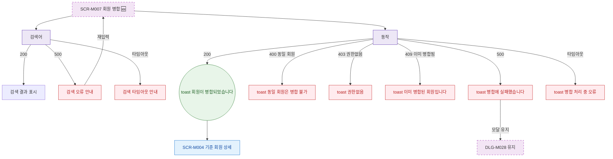

## 1. 목적

SCR-M007에서 발생 가능한 에러 분기와 복구 경로를 명세한다. 🆕 미구현 기능.

## 2. 트리거/전제조건

- SCR-M007 API 호출 실패 발생 시

## 3. 다이어그램

## 4. 엣지 설명

| 출발 | 도착 | 조건 |
|------|------|------|
| 검색 API | 검색 오류 | 500 |
| 병합 API | toast | 400 동일 회원 |
| 병합 API | toast | 403 권한 없음 |
| 병합 API | toast | 409 이미 병합됨 |
| 병합 API | toast | 500 |
| 병합 API | toast | 타임아웃 |
