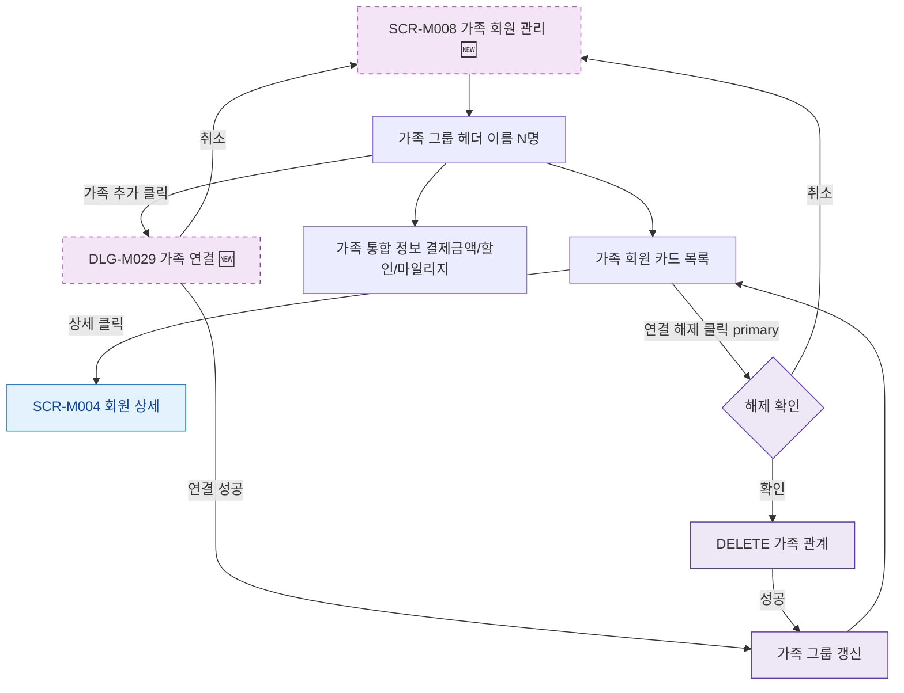

## 1. 목적

SCR-M008 가족 회원 관리의 Happy Path를 명세한다. 🆕 미구현 기능.

## 2. 트리거/전제조건

- SCR-M008 진입 완료

## 3. 다이어그램

## 4. 엣지 설명

| 출발 | 도착 | 조건 |
|------|------|------|
| 가족 추가 버튼 | DLG-M029 | 클릭 |
| DLG-M029 | 가족 그룹 갱신 | 연결 성공 |
| 가족 카드 상세 | SCR-M004 | 클릭 |
| 연결 해제 | 해제 확인 | 클릭 |
| 해제 확인 | DELETE API | 확인 |
