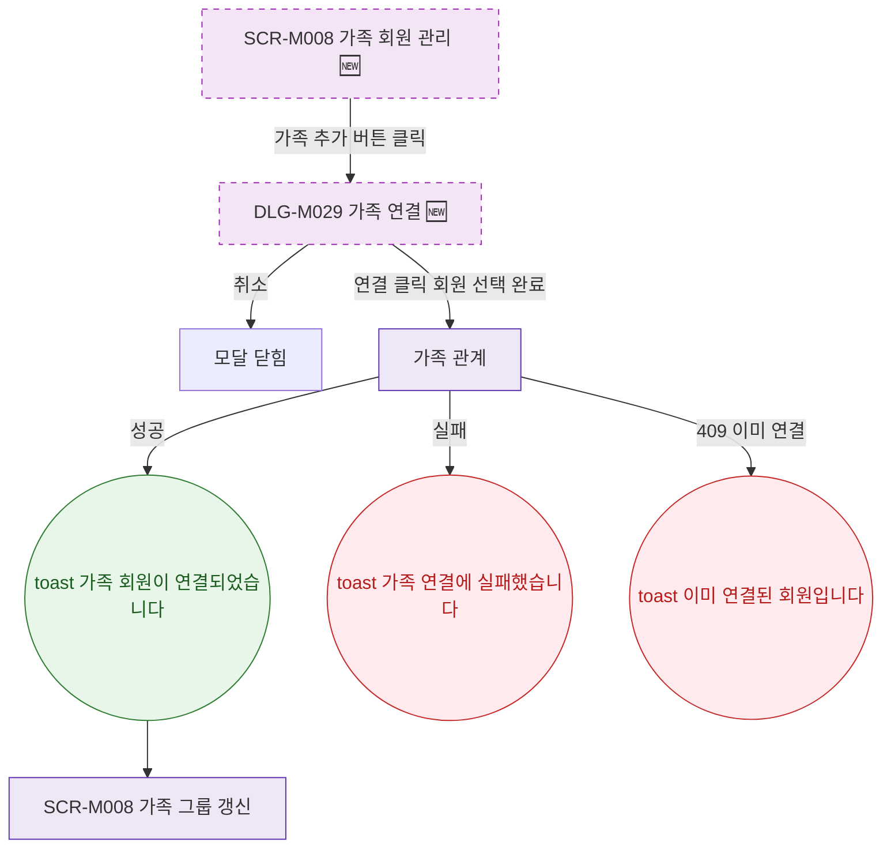

## 1. 목적

SCR-M008에서 열리는 모달의 트리거 경로를 명세한다. 🆕 미구현 기능.

## 2. 트리거/전제조건

- SCR-M008 렌더링 완료, primary 역할

## 3. 다이어그램

## 4. 엣지 설명

| 출발 | 도착 | 조건 |
|------|------|------|
| 가족 추가 버튼 | DLG-M029 | 클릭 |
| DLG-M029 | 모달 닫힘 | 취소 |
| DLG-M029 | API | 연결 클릭 |
| API | toast | 성공 |
| API | toast | 이미 연결됨 |
